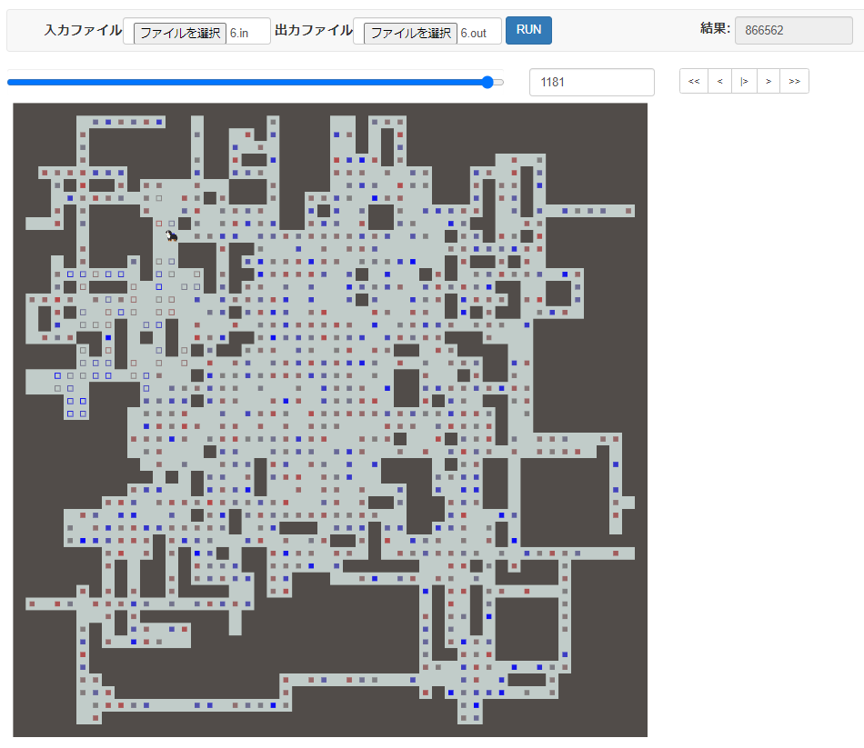
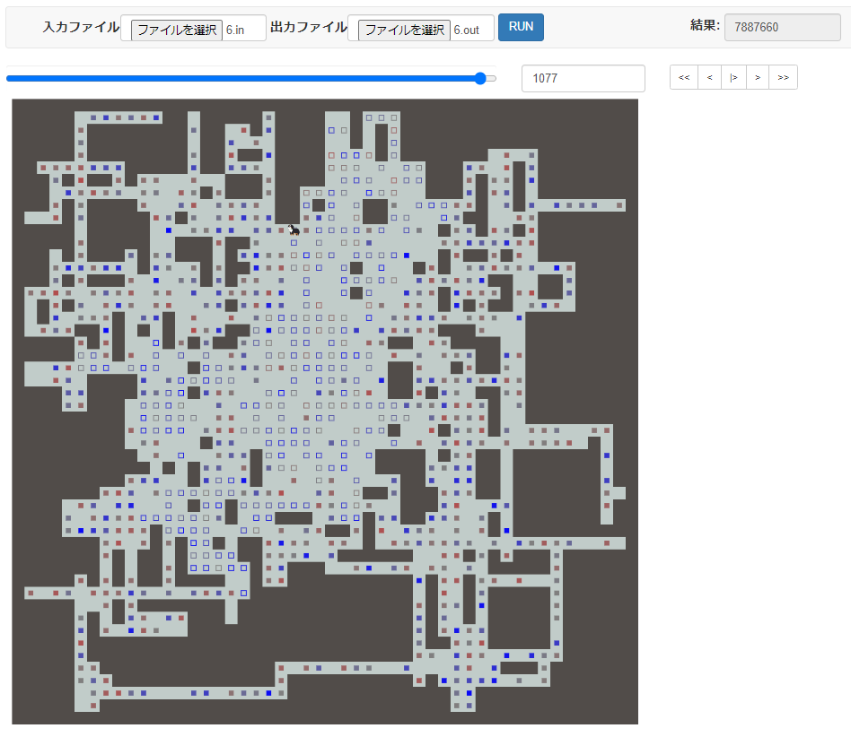
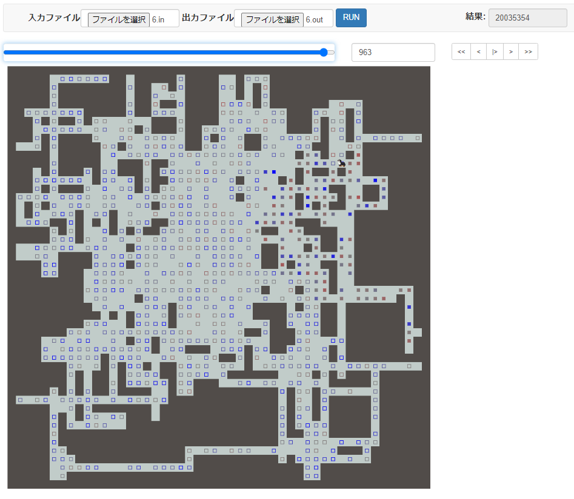

## RCO presents 日本橋ハーフマラソン 予選 B

#### 2022/01/03

* ランダムウォーク
* 腐った餌を食べて悲惨なことになる

提出: https://atcoder.jp/contests/rco-contest-2017-qual/submissions/28300922

---

* ランダムウォーク
* シミュレータを書く
* スコア最大時点で打ち切り

提出: https://atcoder.jp/contests/rco-contest-2017-qual/submissions/28301098

---

* ランダムウォーク
* 時間いっぱいランダム
* 300000 iter くらい回る
* 6343 点で 80 位くらい

提出: https://atcoder.jp/contests/rco-contest-2017-qual/submissions/28301178

---

* ランダムウォーク
* 100 区間 (25 文字ずつ) に分けて iterative にシミュレーション
* 15253 点で 35 位
* ビーム系も筋悪というわけではなさそう？
* 無駄な動きが沢山あって有効ターン数も 1200 とかなので、TSP の方が良さそうではあるが…

提出: https://atcoder.jp/contests/rco-contest-2017-qual/submissions/28301305

---

* 距離を最小化する TSP のみ
* 100M loop くらい回る　やっぱ速い
* 終点自由端を初めて実装したので後でライブラリ化したい…
* 15945 点で 31 位
* 実スコアではないが前の提出よりはマシ、くらい

提出: https://atcoder.jp/contests/rco-contest-2017-qual/submissions/28301804

---

* 距離を最小化する TSP + 生スコアでの TSP
* 16304 点で 24 位
* 思ったより改善しなかった
* 負のスコアの点を通ってしまっているから？貪欲ベースの方が実はよかったりする…？

提出: https://atcoder.jp/contests/rco-contest-2017-qual/submissions/28302032

---

* 距離を最小化する TSP で初期解構築
* <b>価値の低い餌を取る必要はない</b>
* 「どの餌をスキップするか？」の全探索をスコアが上がらなくなるまで繰り返す
* 18369 点で 7 位

提出: https://atcoder.jp/contests/rco-contest-2017-qual/submissions/28302320